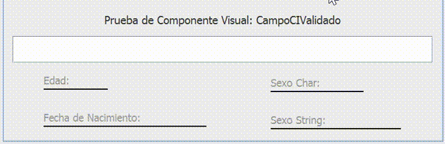
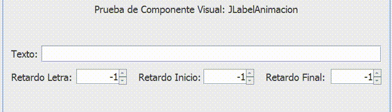
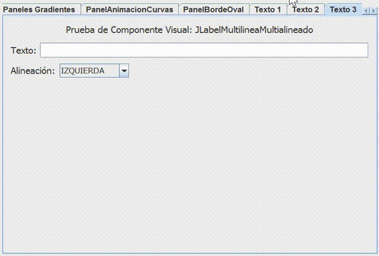
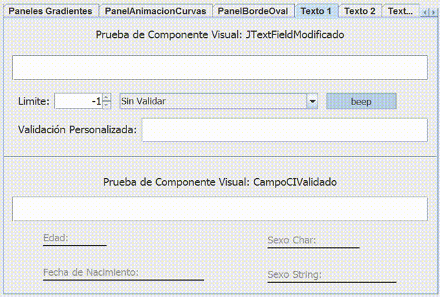
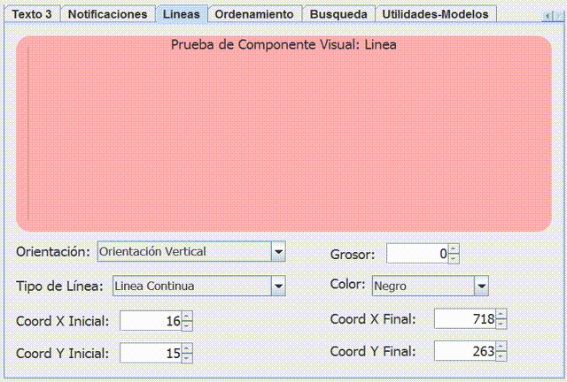
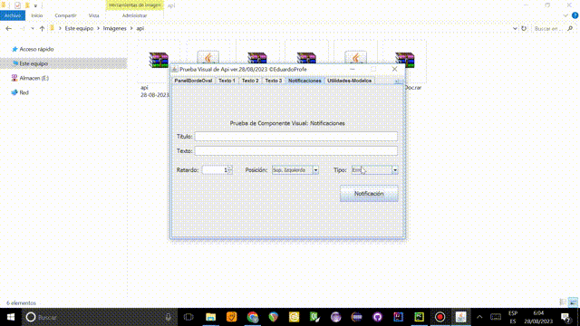
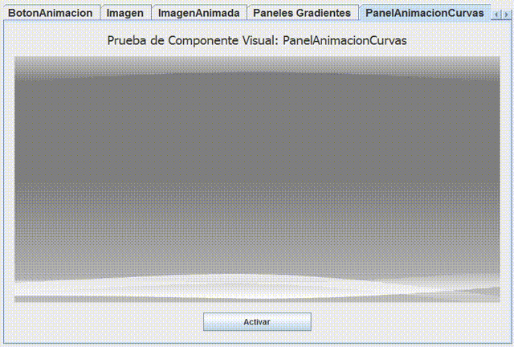
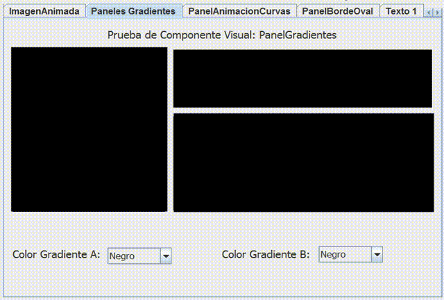
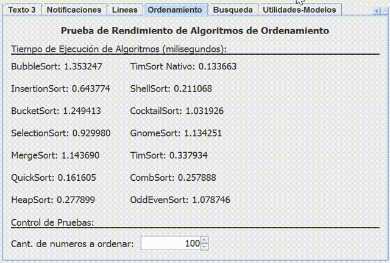
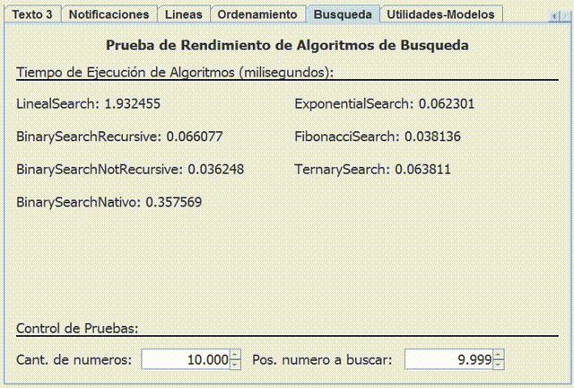

# Api Personalizada en Java
 [](http://www.apache.org/licenses/LICENSE-2.0)  

<p>Api personalizada con componentes visuales personalizados y utilidades.</p>

<p>Para el correcto funcionamiento de la api es necesario al menos <b>Java 1.8</b>. Todos los componentes visuales de la api fueron creados y, por tanto, son compatibles con <b>Java Swing</b>.</p>

<p>Existen dos versiones, una con todas las funcionalidades, y una versión lite
sin el ManejadorLookAndFeels. Si se usa la Lite, tener en cuenta que 
algunos componentes visuales se ven mejor con un Look and Feel diferente
al predeterminado.</p>

<p>La api, tanto en su versión estándar, como en su versión Lite, están documentadas,
y se generaron sus respectivas documentaciones JavaDoc, que se encuentran en las carpetas
DocApi. Pueden ser vinculadas al proyecto como muestra el tutorial con enlace al final de este documento.</p>

<p>La api.jar, en ambas versiones, puede ser ejecutada para poder tener acceso a una prueba visual preliminar
de la mayoría de sus componentes visuales. En futuras versiones se continuará mejorando.</p>

**Versión Actual**: `2023/08/28`
- **Enlace de descarga en Github**: [descargar última versión.](https://github.com/EduardoProfe666/Proyecto-Api-Personalizada/releases/latest)
- **Enlace de descarga en Google Drive**: [descargar última versión.](#google-drive)
> [!WARNING]
> Existen secciones de utilidades de la api que no fueron probadas correctamente, por lo que pueden existir bugs.

# Cambios de la última actualización:
  - **Nuevos componentes visuales**: `JLabelMultilineaMultialineado` e `ImagenAnimada`(Beta).
  - **Nuevas utilidades**: `GeneradorNombres`, `GeneradorContraseñas` y `GeneradorCICubano`.
  - **Corrección de errores menores**.

# Índice de Contenido:

- [Importación de la api](#importación-de-la-api)
- [Prueba Visual de la api](#prueba-visual-de-la-api)
- [Componentes Actuales](#componentes-actuales)
  - [Componentes Visuales](#componentes-visuales)
  - [Utilidades](#utilidades)
    - [Auxiliares](#auxiliares)
    - [Auxiliares Visuales](#auxiliares-visuales)
    - [GeneradorCICubano](#generadorcicubano)
    - [GeneradorContraseñas](#generadorcontraseñas)
    - [GeneradorNombres](#generadornombres)
    - [ManejadorLookAndFeels](#manejadorlookandfeels) 
    - [Validaciones](#validaciones)
  - [Algoritmos](#algoritmos)
    - [Ordenamiento](#ordenamiento)
    - [Búsqueda](#búsqueda) 
- [Enlaces](#enlaces) 
  - [Youtube](#youtube)
  - [Google Drive](#google-drive)

> [!NOTE]
> Algunas imágenes tardan un tiempo prolongado en cargarse en dependencia de la velocidad de conexión a Intenet.

# Importación de la api:
Para poder importar la api puede ver el [siguiente video](https://www.youtube.com/watch?v=hN1BojF_lsY) en youtube donde se explica paso a paso este proceso.
<br>Los pasos resumidos son:
- Copiar la api.jar/apiLite.jar al proyecto.
- Añadir el fichero copiado al Build Path del proyecto.
- Usar la api 👾.


# Prueba Visual de la api:
<p>La api contiene una prueba visual que permite comprobar los componentes visuales que se incluyen. Para poder acceder a ella 
simplemente haga doble clic en el archivo .jar de la api (tanto en la versión estándar como en la versión lite).</p>


# Componentes Actuales: 
## Componentes Visuales:
  - <b>`AvatarCircular`</b>: Permitirá la representación de un avatar circular con tamaño y color de borde variable, dada una imagen.


  > Constructores:
  > ```java
  > AvatarCircular avatar = new AvatarCircular(new ImageIcon(ClaseBase.class.getResource("/img/avatar.png")),2);
  > ```
 
  <br>  <br>

  - <b>`BotonAnimacion`</b>: Permitirá el modelado de un botón con animación al ser presionado.
  
  

  > Constructores:
  > ```java
  > BotonAnimacion btn = new BotonAnimacion();
  > ```
  
  <br>  <br>

  - <b>`CampoCIValidado`</b>: Permitirá el empleo de un JFormattedTextField modificado para la validación en tiempo real del carnet de identidad. Una vez válido, extrae información del mismo, dígase edad, fecha de nacimiento y sexo.</li>
  
  

> Constructores:
  > ```java
  > CampoCIValidado campo = new CampoCIValidado();
  > CampoCIValidado campo2 = new CampoCIValidado(new Date(),new Date());
  > ```

  
  <br>  <br>

  - <b>`Imagen`</b>: Permitirá la generación de una imagen que se reajuste automáticamente a las dimensiones dadas.
  


> Constructores:
  > ```java
  > Imagen img = new Imagen(new ImageIcon(ClaseBase.class.getResource("/img/img.png")));
  > ```


  <br>  <br>

  - <b>`ImagenAnimada`</b>: Permitirá modelar una imagen con una animación de movimiento sinusoide en dirección vertical u horizontal.
  > [!IMPORTANT]
  > El componente `ImagenAnimada` se encuentra en fase Beta, por tanto, no se encuentra completamente terminado ni optimizado ni probado.
  > Solo se garantiza su correcto funcionamiento en contenedores con Absolute Layout.
  
   

  > Constructores:
  > ```java
  > ImagenAnimada img = new ImagenAnimada(ClaseBase.class.getResource("/img/img.png"),50,50,14,100,Direccion.Vertical);
  > ```

  <br>  <br>

  - <b>`JLabelAnimacion`</b>: Permitirá la modelación de un JLabel con texto animado.
 
  

 > Constructores:
  > ```java
  > JLabelAnimacion lbl = new JLabelAnimacion("HOLA", -1, -1, -1);
  > ```


  <br>  <br>
  
  - <b>`JLabelHora`</b>: Permitirá la modelación de un reloj digital, con distintos formatos de hora.
 
  

 > Constructores:
  > ```java
  > JLabelHora reloj = new JLabelHora(JLabelHora.FORMATO_PREDETERMINADO);
  > ```
  

  <br>  <br>

  - <b>`JLabelMultilineaMultialineado`</b>: Permitirá la modelación de un JLabel con capacidad de mostrar texto extenso en múltiples líneas y alinearlo de diversas formas, pudiendo estar justificado.
 


 > Constructores:
  > ```java
  > JLabelMultilineaMultialineado lbl = new JLabelMultilineaMultialineado("JIIII", Alineacion.JUSTIFICADA);
  > ```

  <br>  <br>

  - <b>`JTextFieldModificado`</b>: Permitirá el empleo de un JTextField modificado, con un límite, validado o no con letras o dígitos, y con o sin efecto de sonido.
  


> Constructores:
  > ```java
  > JTextFieldModificado text = new JTextFieldModificado();
  > ```


  <br>  <br>

  - <b>`Linea`</b>: Permitirá generar una línea, pudiendo ser personalizada con el grosor, color, orientación y el tipo de línea.</li>
  
 

> Constructores:
  > ```java
  > Linea lin = new Linea(Linea.ORIENTACION_VERTICAL, Linea.LINEA_DISCONTINUA);
  > ```


  <br>  <br>

  - <b>`Notificaciones`</b>: Permitirá el empleo de un sistema de notificaciones, con posiciones variables y diferentes tipos de notificaciones.</li>
  


> Constructores:
  > ```java
  > Notificaciones ntf = new Notificaciones("HOLA","JELOU",2,Notificaciones.POSICION_INF_DER, Notificaciones.MENSAJE_EXITO);
  > ```

  <br>  <br>

  - <b>`PanelAnimacionCurvas`</b>: Permitirá la modelación de un panel con animación. Puede ser empleado en pantallas de carga.
 
  

 > Constructores:
  > ```java
  > PanelAnimacionCurvas pan = new PanelAnimacionCurvas((Color) null, (Color) null, (Color) null, (Color) null);
  > ```


  <br>  <br>

  - <b>`PanelBordeOval`</b>: Permitirá la modelación de un panel con bordes ovales variables, sin necesidad de ser equitativos.
 
 

 > Constructores:
  > ```java
  > PanelBordeOval pan = new PanelBordeOval(20);
  > PanelBordeOval pan = new PanelBordeOval(20,15,10,30)
  > ```

  <br>  <br>

  - <b>`PanelGradiente`</b>: Permitirá la modelación de un panel gradiente. Es el empleado en PanelAnimacionCurvas.
  


> Constructores:
  > ```java
  > PanelGradiente pan = new PanelGradiente(Color.YELLOW,Color.GREEN);
  > ```

  <br>  <br>

  - <b>`PanelGradienteH`</b>: Permitirá la modelación de un panel gradiente con sentido horizontal.
  


> Constructores:
  > ```java
  > PanelGradienteH pan = new PanelGradienteH(Color.YELLOW,Color.GREEN);
  > ``
  
  <br>  <br>

  - <b></b>`PanelGradienteV`</b>: Permitirá la modelación de un panel gradiente con sentido vertical.
 


 > Constructores:
  > ```java
  > PanelGradienteV pan = new PanelGradienteV(Color.YELLOW,Color.GREEN);
  > ```


## Utilidades:

> [!IMPORTANT]
> Todos los métodos de las utilidades se emplean de manera estática. Por ejemplo:
> ```java
> String ci_generado = GeneradorCICubano.generarCICubano(Sexo.MASCULINO,36);
> ```

### Auxiliares:
  - <b>`convertirFechaNacimientoCiDate`(String)</b>: Permite extraer la fecha de nacimiento del carnet de identidad.
  - <b>`determinarEdad`(Date)</b>: Permite determinar la edad actual de la persona que haya nacido en la fecha dada.
  - <b>`determinarDiferenciaAnyos`(Date, Date)</b>: Permite determinar la diferencia en años entre dos fechas.
  - <b>`determinarSexo`(String)</b>: Permite determinar el sexo Char dado el carnet de identidad.
  - <b>`determinarSexoString`(String)</b>: Permite determinar el sexo String dado el carnet de identidad.
  - <b>`sumarAnyosFecha`(Date, int)</b>: Permite sumar (o restar) años a una determinada fecha.
  - <b>`cantidadCaracteresEntero`(int)</b>: Permite determinar la cantidad de caracteres que tendría un entero en caso de que fuera String.
  - <b>`introducirElementoListadoOrdenado`(List, Comparable...)</b>: Permite introducir una serie de elementos en un listado de forma ordenada. Dichos elementos deben ser comparables entre sí de forma natural (Comparable)

### Auxiliares Visuales:
  - <b>`ajustarImagen(Dimension, URL)`</b>: Permite redimensionar la imagen a unas dimensiones dadas. Su mejor empleo es en el redimensionamiento de las imágenes para iconos, ya sea en JButtons, como en JLabels y demás.

### GeneradorCICubano:
<p>Permitirá la generación de ci cubanos válidos, únicos y de forma aleatoria. Los métodos implementados son:</p>

- **`generarCICubano(Sexo, int)`**: Permite crear un ci cubano válido de forma aleatoria con un determinado sexo y edad. 
- **`generarCICubano(Sexo, int, int)`**: Permite crear un ci cubano válido de forma aleatoria con un determinado sexo y una edad aleatoria dentro del rango de edadMin y edadMax.
- **`generarListadoCICubano(int, Sexo, int, int)`**: Permite crear un listado con una cantidad determinada ci cubanos únicos, válidos y de forma aleatoria con un determinado sexo y una edad aleatoria dentro del rango de edadMin y edadMax.
- **`generarInformeListadoCiCubano(int, Sexo, int, int)`**: Permite crear un fichero txt que contiene un listado con una cantidad determinada ci cubanos únicos, válidos y de forma aleatoria con un determinado sexo y una edad aleatoria dentro del rango de edadMin y edadMax.

<p>Los sexos actualmente soportados son:</p> 

- **`FEMENINO`**
- **`MASCULINO`**
- **`ALEATORIO`**

### GeneradorContraseñas:
<p>Permitirá la generación de contraseñas aleatorias de diversos tipos. Los métodos implementados son:</p>

- **`generarContraseña(TipoContraseña)`**: Permite crear una contraseña de longitud aleatoria (10-30 caracteres) con caracteres del tipo seleccionado. 
- **`generarContraseña(int, TipoContraseña)`**: Permite crear una contraseña de longitud determinada con caracteres del tipo seleccionado.
- **`generarContraseña(int, CharSequence)`**: Permite crear una contraseña de longitud determinada con caracteres procedentes del `CharSequence` o `String` proporcionado.

<p>Los tipos de contraseñas actualmente soportados son:</p>

- **`ALFANUMERICA`**: Caracteres tanto dígitos como alfabéticos mayúscula y minúscula.
- **`NUMERICA`**: Caracteres de tipo dígito.
- **`ALFABETICA`**: Caracteres alfabéticos mayúscula y minúscula.
- **`ALFABETICA_MINUSCULA`**: Caracteres alfabéticos mayúscula.
- **`ALFABETICA_MAYUSCULA`**: Caracteres alfabético minúscula.

### GeneradorNombres:
<p>Permitirá la generación de nombres femeninos y masculinos y apellidos. Los métodos implementados son:</p>

- **`generarNombre(Sexo, Complejidad)`**: Permite generar un nombre aleatorio con determinado sexo y complejidad.
- **`generarNombres(Sexo)`**: Permite generar el listado completo de nombres disponibles de un determinado sexo (o ambos).
- **`generarNombres(int, Sexo)`**: Permite generar un listado con una cantidad de nombres únicos de un determinado sexo (o ambos). 
- **`generarApellido(Complejidad)`**: Permite generar un apellido aleatorio con una determinada complejidad.
- **`generarApellidos()`**: Permite generar el listado completo de apellidos disponibles.
- **`generarApellidos(int)`**: Permite generar un listado con una cantidad de apellidos únicos.
- **`generarNombreYApellidos(Sexo, Complejidad, Complejidad)`**: Permite generar un nombre y apellidos con un determinado sexo, complejidad del nombre y complejidad del apellido.
- **`generarListadoNombreYApellidos(int, Sexo, Complejidad, Complejidad)`**: Permite generar un listado con una cantidad de nombres y apellidos con un determinado sexo, complejidad del nombre y complejidad del apellido.
- **`generarInformeListadoNombreYApellidos(int, Sexo, Complejidad, Complejidad)`**: Permite crear un fichero txt que contiene un listado con una cantidad de nombres y apellidos con un determinado sexo, complejidad del nombre y complejidad del apellido.

<p>Los sexos actualmente soportados son:</p> 

- **`FEMENINO`**
- **`MASCULINO`**
- **`ALEATORIO`**

<p>Las complejidades de nombres y apellidos actualmente soportadas son:</p>

- **`SIMPLE`**: Nombres y apellidos con una sola ocurrencia.
- **`COMPUESTA`**: Nombres y apellidos con doble ocurrencia.
- **`ALEATORIO`**: Nombres y apellidos tanto **`SIMPLE`** como **`COMPUESTA`**.

<p>Los listados de nombres y apellidos que sirven de piscina de datos son los siguientes:</p>

- [Listado de nombres masculinos](assets/nombres/nombres_masculinos.txt).
- [Listado de nombres femeninos](assets/nombres/nombres_femeninos.txt).
- [Listado de apellidos](assets/nombres/apellidos.txt).

### ManejadorLookAndFeels:


<p>Permitirá el manejo de los look and feels referenciados, de una manera sencilla permitiendo<br>
realizarlo incluso en tiempo de ejecución. Los Look And Feels actualmente soportados son:</p>
<ul>
  <li><b>Metal (Predeterminado)
  <li>Nimbus
  <li>Windows
  <li>Windows Classic
  <li>CDE-MOTIF
  <li>FlatLaf
  <li>JTattoo
  <li>Liquid
  <li>Nimrod
  <li>Tiny
  <li>Tonic
  <li>JGoodies</b>
</ul>

### Validaciones:
*   <b>`validarNumeroRango(double, double, double)`</b>: Permite validar si un valor se encuentra en un rango dado.
*   <b>`validarTamString(String, int, int)`</b>: Permite validar si un String tiene un tamaño en un rango dado.
*   <b>`validarStringTodoLetra(String)`</b>: Permite validar si un String está compuesto solo por letras o espacios.
*   <b>`validarStringTodoDigito(String)`</b>: Permite validar si un String está compuesto solo por dígitos.
*   <b>`validarStringTodoDigitoLetraSinEspacio(String)`</b>: Permite validar si un String está compuesto solo por letras y dígitos, sin espacios.
*   <b>`validarStringNoTodoEspacio(String)`</b>: Permite validar si un String no es todo espacios.
*   <b>`validarStringNoVacio(String)`</b>: Permite validar si un String no es null ni está vacío.
*   <b>`validarStringNoEspacio(String)`</b>: Permite validar si un String no tiene espacios.
*   <b>`validarNoRepeticionLista(List)`</b>: Permite validar su una Lista no contiene elementos repetidos. Los elementos deben ser comparables entre sí de manera natural (Comparable).
*   <b>`validarNoRepeticionLista(List, Comparator)`</b>: Permite validar si una lista no contiene elementos repetidos. El Comparator indicará la forma de comparación entre los elementos.
*   <b>`validarNoRepeticionElementoLista(List, Comparable)`</b>: Permite validar si una lista no contiene a un elemento específico. Los elementos deben ser comparables entre sí de manera natural (Comparable).
*   <b>`validarNoRepeticionElementoLista(List, Object, Comparator)`</b>: Permite validar si una lista no contiene a un elemento específico. El Comparator indicará la forma de comparación entre los elementos.
*   <b>`validarNoRepeticionListas(List...)`</b>: Permite validar que las listas no contengan elementos comunes.
*   <b>`validarFechaNacimientoCi(String, Date, Date)`</b>: Permite validar la fecha de nacimiento del carnet de identidad. Si se pasa un rango de fechas, se comprobará que se encuentre en dicho rango.
*   <b>`validarCI(String, Date, Date)`</b>: Permite validar el carnet de identidad.
*   <b>`~~validarRangoFecha(Date, Date, Date)~~`</b>: Permite validar que una fecha se encuentre en un rango de fechas dado

## Algoritmos:
> [!IMPORTANT]
> Todos los algoritmos se emplean de manera estática. Por ejemplo:
> ```java
> List<Integer> lista = new ArrayList<>(Arrays.asList(4034,56324,2311,2,5,3));
> int indice = Busqueda.fibonacciSearch(lista,5);
> ```

### Ordenamiento:



<p>Presenta un <b>PruebaAlgoritmoOrdenamiento</b> que contiene pruebas en consola de tiempo de ejecución a los algoritmos de Ordenamiento. Tener en cuenta 
que estas pruebas son superficiales y no determinan la eficiencia de los algoritmos.<br>Los algoritmos de ordenamiento actualmente implementados son:</p>
<ul>
  <b>
    <li>Ordenamiento de Burbuja (Bubble Sort)</li>
    <li>Ordenamiento por Inserción (Insertion Sort)</li>
    <li>Ordenamiento de Cubos (Bucket Sort)</li>
    <li>Ordenamiento por Selección (Selection Sort)</li>
    <li>Ordenamiento de Fusión (Merge Sort)</li>
    <li>Ordenamiento Rápido (Quick Sort)</li>
    <li>Ordenamiento de Montículo (Heap Sort)</li>
    <li>Ordenamiento de base (Radix Sort)</li>
    <li>Ordenamiento de Shell-Metzner (Shell Sort)</li>
    <li>Ordenamiento de Coctél (Cocktail Sort)</li>
    <li>Ordenamiento de Peine Mejorado (Comb Sort)</li>
    <li>Ordenamiento de Gnome (Gnome Sort)</li>
    <li>Tim Sort Nativo en Collections</li>
    <li>Ordenamiento de Pares e Impares (Odd Even Sort)</li>
    <li>Ordenamiento por Mezcla Natural (Tim Sort)</li>
  </b>
</ul>

### Búsqueda: 



<p>Presenta un <b>PruebaAlgoritmoBusqueda</b> que contiene pruebas en consola de tiempo de ejecución a los algoritmos de Busqueda. Tener en cuenta 
que estas pruebas son superficiales y no determinan la eficiencia de los algoritmos.<br>Los algoritmos de búsqueda actualmente implementados son:</p>
<ul>
  <b>
    <li>Búsqueda Lineal (Lineal Search)</li>
    <li>Búsqueda Binaria Nativa en Collections</li>
    <li>Búsqueda Binaria Recursiva (Recursive Binary Search)</li>
    <li>Búsqueda Binaria No Recursiva (Not Recursive Binary Search)</li>
    <li>Búsqueda Exponencial (Exponential Search)</li>
    <li>Búsqueda Fibonacci (Fibonacci Search)</li>
    <li>Búsqueda Ternaria (Ternary Search)</li>
  </b>
</ul>

# Enlaces:

## Youtube:
- **[쮺칩mo importar la api, vincularle el JavaDoc y trabajar con ella?](https://www.youtube.com/watch?v=hN1BojF_lsY)**


## Google Drive:
- **[Versión Estándar](https://drive.google.com/file/d/194eeuu4QhYpQj8gkoJ0_NuF5BbtkVAVs/view?usp=sharing)**
- **[Versión Lite](https://drive.google.com/file/d/1X2FFDOlaKBD1-La_shhLjDKlPHXlY9lr/view?usp=sharing)**
