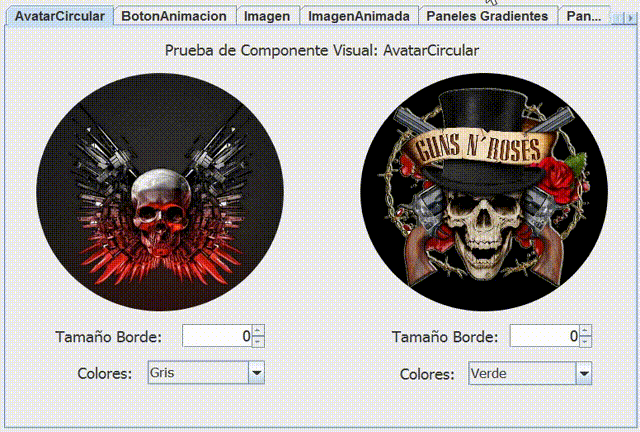
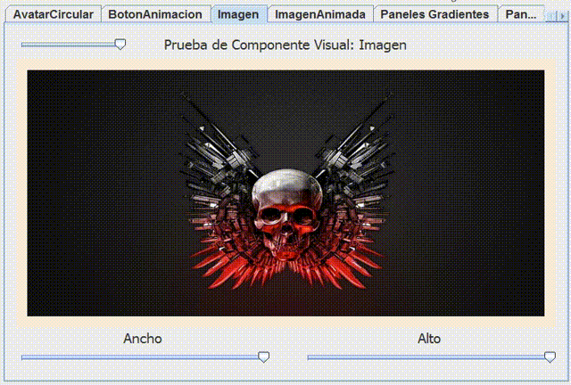
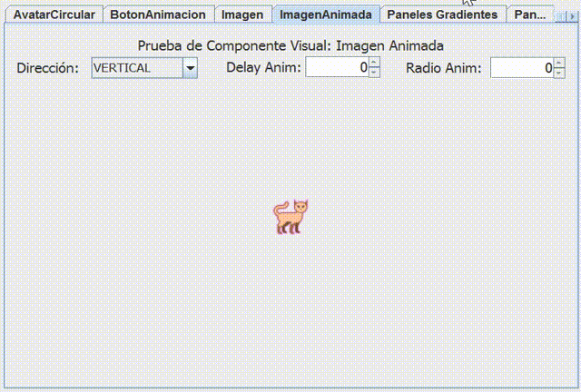
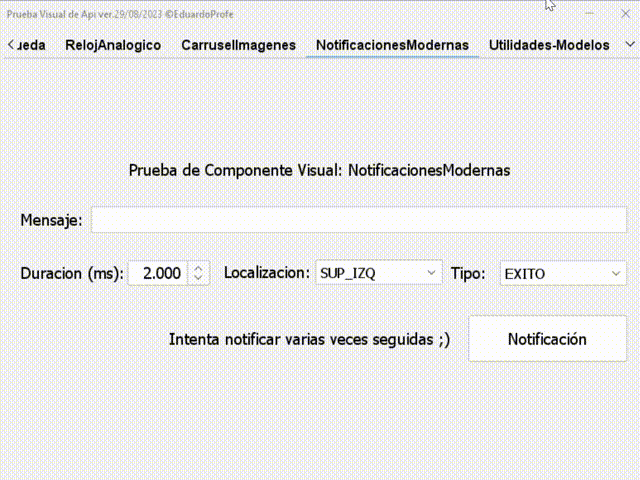
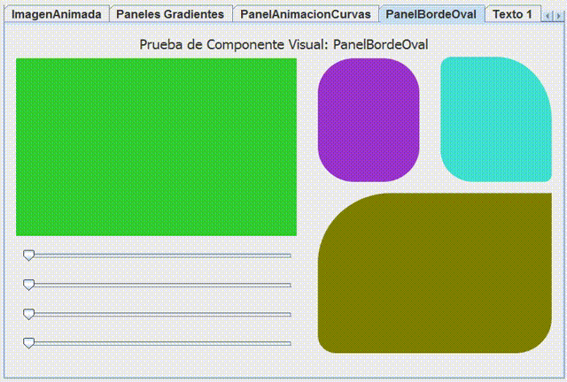
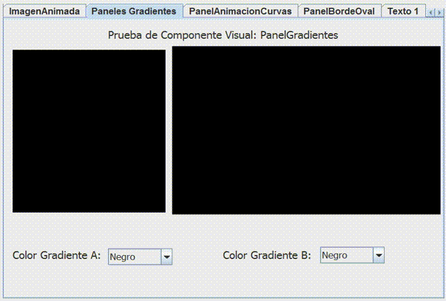
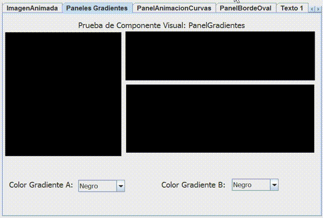
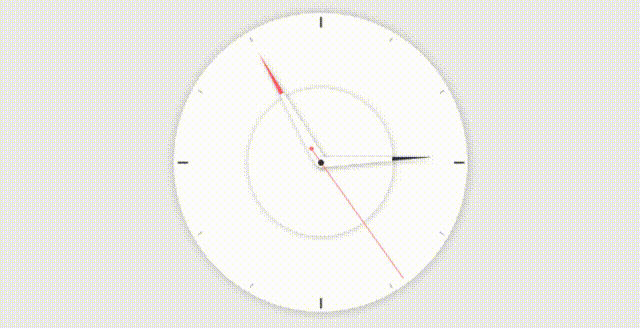
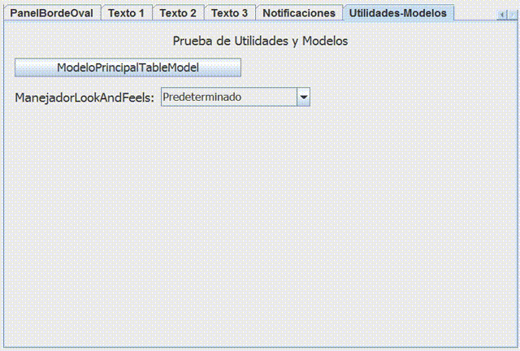

# Api Personalizada en Java
[](https://github.com/EduardoProfe666/Proyecto-Api-Personalizada)
[](https://tlo.mit.edu/learn-about-intellectual-property/software-and-open-source-licensing/open-source-licensing) 
 
[](https://github.com/EduardoProfe666/Proyecto-Api-Personalizada/releases) 

[](https://github.com/EduardoProfe666/Proyecto-Api-Personalizada/commits/master)

<p>Api personalizada con componentes visuales personalizados y utilidades.</p>

<p>Existen dos versiones, una con todas las funcionalidades, y una versión lite
sin el ManejadorLookAndFeels ni NotificacionesModernas. Si se usa la Lite, tener en cuenta que 
algunos componentes visuales se ven mejor con un Look and Feel diferente
al predeterminado.</p>

<p>La api, tanto en su versión estándar, como en su versión Lite, están documentadas,
y se generaron sus respectivas documentaciones JavaDoc, que se encuentran en las carpetas
DocApi. Pueden ser vinculadas al proyecto como muestra el tutorial con enlace al final de este documento.</p>

<p>La api.jar, en ambas versiones, puede ser ejecutada para poder tener acceso a una prueba visual preliminar
de la mayoría de sus componentes visuales. En futuras versiones se continuará mejorando.</p>

<p>Si te gustó la api💛 dale una estrellita al repositorio 😋☝</p>

**Versión Actual**: `2023/08/29`
- **Enlace de descarga en Github**: [descargar última versión.](https://github.com/EduardoProfe666/Proyecto-Api-Personalizada/releases/latest)
- **Enlace de descarga en Google Drive**: [descargar última versión.](#google-drive)
> [!WARNING]
> Existen secciones de utilidades de la api que no fueron probadas correctamente, por lo que pueden existir bugs.

> [!IMPORTANT]
> Para el correcto funcionamiento de la api es necesario al menos **Java 1.8**. Todos los componentes visuales de la api fueron creados y, por tanto, son compatibles con **Java Swing**.

# Cambios de la última actualización:
  - **Nuevos componentes visuales**: `RelojAnalogico`, `NotificacionesModernas` y `CarruselImagenes`.
  - **Corrección de errores menores**.

# Índice de Contenido:

- [Importación de la api](#importación-de-la-api)
- [Prueba Visual de la api](#prueba-visual-de-la-api)
- [Componentes Actuales](#componentes-actuales)
  - [Componentes Visuales](#componentes-visuales)
  - [Utilidades](#utilidades)
    - [Auxiliares](#auxiliares)
    - [Auxiliares Visuales](#auxiliares-visuales)
    - [GeneradorCICubano](#generadorcicubano)
    - [GeneradorContraseñas](#generadorcontraseñas)
    - [GeneradorNombres](#generadornombres)
    - [ManejadorLookAndFeels](#manejadorlookandfeels) 
    - [Validaciones](#validaciones)
  - [Algoritmos](#algoritmos)
    - [Ordenamiento](#ordenamiento)
    - [Búsqueda](#búsqueda) 
- [Enlaces](#enlaces) 
  - [Youtube](#youtube)
  - [Google Drive](#google-drive)

> [!NOTE]
> Algunas imágenes tardan un tiempo prolongado en cargarse en dependencia de la velocidad de conexión a Intenet.

# Importación de la api:
Para poder importar la api puede ver el [siguiente video](https://www.youtube.com/watch?v=hN1BojF_lsY) en youtube donde se explica paso a paso este proceso.
<br>Los pasos resumidos son:
- Copiar la api.jar/apiLite.jar al proyecto.
- Añadir el fichero copiado al Build Path del proyecto.
- Usar la api 👾.


# Prueba Visual de la api:
<p>La api contiene una prueba visual que permite comprobar los componentes visuales que se incluyen. Para poder acceder a ella 
simplemente haga doble clic en el archivo .jar de la api (tanto en la versión estándar como en la versión lite).</p>


# Componentes Actuales: 
## Componentes Visuales:
  - <b>`AvatarCircular`</b>: Permitirá la representación de un avatar circular con tamaño y color de borde variable, dada una imagen.



  > Constructores:
  > ```java
  > AvatarCircular avatar = new AvatarCircular(new ImageIcon(ClaseBase.class.getResource("/img/avatar.png")),2);
  > ```
 
  <br>  <br>

  - <b>`BotonAnimacion`</b>: Permitirá el modelado de un botón con animación al ser presionado.
  
  

  > Constructores:
  > ```java
  > BotonAnimacion btn = new BotonAnimacion();
  > ```
  
  <br>  <br>

  - <b>`CampoCIValidado`</b>: Permitirá el empleo de un JFormattedTextField modificado para la validación en tiempo real del carnet de identidad. Una vez válido, extrae información del mismo, dígase edad, fecha de nacimiento y sexo.
  
  

> Constructores:
  > ```java
  > CampoCIValidado campo = new CampoCIValidado();
  > CampoCIValidado campo2 = new CampoCIValidado(new Date(),new Date());
  > ```

  <br>  <br>

   - <b>`CarruselImagenes`</b>: Permitirá el empleo de un carrusel de imágenes.
  
  

> Constructores:
  > ```java
  > CarruselImagenes carrusel = new CarruselImagenes(700);
  > ```

> Ejemplo de Uso:
  > ```java
  > carrusel.addImage(ClaseBase.class.getResource("/imagenes/1.jpg"));
  > carrusel.addImage(ClaseBase.class.getResource("/imagenes/2.jpg"));
  > carrusel.iniciarAnimacion();
  > ```
  
  <br>  <br>

  - <b>`Imagen`</b>: Permitirá la generación de una imagen que se reajuste automáticamente a las dimensiones dadas.
  


> Constructores:
  > ```java
  > Imagen img = new Imagen(new ImageIcon(ClaseBase.class.getResource("/img/img.png")));
  > ```


  <br>  <br>

  - <b>`ImagenAnimada`</b>: Permitirá modelar una imagen con una animación de movimiento sinusoide en dirección vertical u horizontal.
  > [!IMPORTANT]
  > El componente `ImagenAnimada` se encuentra en fase Beta, por tanto, no se encuentra completamente terminado ni optimizado ni probado.
  > Solo se garantiza su correcto funcionamiento en contenedores con Absolute Layout.
  
   

  > Constructores:
  > ```java
  > ImagenAnimada img = new ImagenAnimada(ClaseBase.class.getResource("/img/img.png"),50,50,14,100,Direccion.Vertical);
  > ```

  <br>  <br>

  - <b>`JLabelAnimacion`</b>: Permitirá la modelación de un JLabel con texto animado.
 
  

 > Constructores:
  > ```java
  > JLabelAnimacion lbl = new JLabelAnimacion("HOLA", -1, -1, -1);
  > ```


  <br>  <br>
  
  - <b>`JLabelHora`</b>: Permitirá la modelación de un reloj digital, con distintos formatos de hora.
 
  

 > Constructores:
  > ```java
  > JLabelHora reloj = new JLabelHora(JLabelHora.FORMATO_PREDETERMINADO);
  > ```
  

  <br>  <br>

  - <b>`JLabelMultilineaMultialineado`</b>: Permitirá la modelación de un JLabel con capacidad de mostrar texto extenso en múltiples líneas y alinearlo de diversas formas, pudiendo estar justificado.
 


 > Constructores:
  > ```java
  > JLabelMultilineaMultialineado lbl = new JLabelMultilineaMultialineado("JIIII", Alineacion.JUSTIFICADA);
  > ```

  <br>  <br>

  - <b>`JTextFieldModificado`</b>: Permitirá el empleo de un JTextField modificado, con un límite, validado o no con letras o dígitos, y con o sin efecto de sonido.
  


> Constructores:
  > ```java
  > JTextFieldModificado text = new JTextFieldModificado();
  > ```


  <br>  <br>

  - <b>`Linea`</b>: Permitirá generar una línea, pudiendo ser personalizada con el grosor, color, orientación y el tipo de línea.</li>
  
 

> Constructores:
  > ```java
  > Linea lin = new Linea(Linea.ORIENTACION_VERTICAL, Linea.LINEA_DISCONTINUA);
  > ```


  <br>  <br>

  - <b>`Notificaciones`</b>: Permitirá el empleo de un sistema de notificaciones, con posiciones variables dentro de la pantalla y diferentes tipos de notificaciones.</li>
  


> Las posiciones de las notificaciones actualmente soportadas son:
> - POSICION_SUP_IZQ = 0
> - POSICION_SUP_DER = 1
> - POSICION_INF_IZQ = 2
> - POSICION_INF_DER = 3

> Los tipos de notificaciones actualmente soportados son:
> - ERROR
> - ADVERTENCIA
> - INFORMACION
> - EXITO

> Ejemplo de uso:
  > ```java
  > Notificaciones.lanzarNotificacion("HOLA","JELOU",2,Notificaciones.POSICION_INF_DER, Notificaciones.MENSAJE_EXITO);
  > ```

  <br>  <br>

  - <b>`NotificacionesModernas`</b>: Permitirá el empleo de un sistema de notificaciones modernas, con posiciones variables dentro del componente especificado y diferentes tipos de notificaciones. Incluye la posibilidad de notificar en cascada</li>
  > [!WARNING]
  > Solamente es compatible con componentes que tengan instalado un Look and Feel de `FlatLaf`. En dependencia del `FlatLaf` empleado será la visual del componente.



> [!IMPORTANT]
  > - `NotificacionesModernas` implementa el patrón `Singletone` por lo que para poder acceder a los métodos de la clase se debe "capturar" de la forma `NotificacionesModernas.getInstancia();`
  > - Lo primero que se debe realizar es instalar el sistema de notificaciones en un componente; preferiblemente un `JFrame` o un `JDialog`. Luego se pueden usar los métodos restantes.  

> Ejemplo de uso:
  > ```java
  > JFrame frame = new JFrame();
  > NotificacionesModernas.getInstancia().setJFrame(frame);
  > NotificacionesModernas.getInstancia().show(Tipo.INFO,Localizacion.INF_DER,3000,"Hola!");
  > Notificaciones ntf = new Notificaciones("HOLA","JELOU",2,Notificaciones.POSICION_INF_DER, Notificaciones.MENSAJE_EXITO);
  > ```

  <br>  <br>

  - <b>`PanelAnimacionCurvas`</b>: Permitirá la modelación de un panel con animación. Puede ser empleado en pantallas de carga.
 
  

 > Constructores:
  > ```java
  > PanelAnimacionCurvas pan = new PanelAnimacionCurvas((Color) null, (Color) null, (Color) null, (Color) null);
  > ```


  <br>  <br>

  - <b>`PanelBordeOval`</b>: Permitirá la modelación de un panel con bordes ovales variables, sin necesidad de ser equitativos.
 
 

 > Constructores:
  > ```java
  > PanelBordeOval pan = new PanelBordeOval(20);
  > PanelBordeOval pan = new PanelBordeOval(20,15,10,30)
  > ```

  <br>  <br>

  - <b>`PanelGradiente`</b>: Permitirá la modelación de un panel gradiente. Es el empleado en PanelAnimacionCurvas.
  


> Constructores:
  > ```java
  > PanelGradiente pan = new PanelGradiente(Color.YELLOW,Color.GREEN);
  > ```

  <br>  <br>

  - <b>`PanelGradienteH`</b>: Permitirá la modelación de un panel gradiente con sentido horizontal.
  


> Constructores:
  > ```java
  > PanelGradienteH pan = new PanelGradienteH(Color.YELLOW,Color.GREEN);
  > ``
  
  <br>  <br>

  - <b></b>`PanelGradienteV`</b>: Permitirá la modelación de un panel gradiente con sentido vertical.
 


 > Constructores:
  > ```java
  > PanelGradienteV pan = new PanelGradienteV(Color.YELLOW,Color.GREEN);
  > ```

  <br> <br>

  - <b></b>`RelojAnalogico`</b>: Permitirá la modelación de un reloj analógico.
 


 > Constructores:
  > ```java
  > RelojAnalogico rel = new RelojAnalogico();
  > ```


## Utilidades:

> [!IMPORTANT]
> Todos los métodos de las utilidades se emplean de manera estática. Por ejemplo:
  > ```java
  > String ci_generado = GeneradorCICubano.generarCICubano(Sexo.MASCULINO,36);
  > ```

### Auxiliares:
  - <b>`convertirFechaNacimientoCiDate`(String)</b>: Permite extraer la fecha de nacimiento del carnet de identidad.
  - <b>`determinarEdad`(Date)</b>: Permite determinar la edad actual de la persona que haya nacido en la fecha dada.
  - <b>`determinarDiferenciaAnyos`(Date, Date)</b>: Permite determinar la diferencia en años entre dos fechas.
  - <b>`determinarSexo`(String)</b>: Permite determinar el sexo Char dado el carnet de identidad.
  - <b>`determinarSexoString`(String)</b>: Permite determinar el sexo String dado el carnet de identidad.
  - <b>`sumarAnyosFecha`(Date, int)</b>: Permite sumar (o restar) años a una determinada fecha.
  - <b>`cantidadCaracteresEntero`(int)</b>: Permite determinar la cantidad de caracteres que tendría un entero en caso de que fuera String.
  - <b>`introducirElementoListadoOrdenado`(List, Comparable...)</b>: Permite introducir una serie de elementos en un listado de forma ordenada. Dichos elementos deben ser comparables entre sí de forma natural (Comparable)

### Auxiliares Visuales:
  - <b>`ajustarImagen(Dimension, URL)`</b>: Permite redimensionar la imagen a unas dimensiones dadas. Su mejor empleo es en el redimensionamiento de las imágenes para iconos, ya sea en JButtons, como en JLabels y demás.

### GeneradorCICubano:
<p>Permitirá la generación de ci cubanos válidos, únicos y de forma aleatoria. Los métodos implementados son:</p>

- **`generarCICubano(Sexo, int)`**: Permite crear un ci cubano válido de forma aleatoria con un determinado sexo y edad. 
- **`generarCICubano(Sexo, int, int)`**: Permite crear un ci cubano válido de forma aleatoria con un determinado sexo y una edad aleatoria dentro del rango de edadMin y edadMax.
- **`generarListadoCICubano(int, Sexo, int, int)`**: Permite crear un listado con una cantidad determinada ci cubanos únicos, válidos y de forma aleatoria con un determinado sexo y una edad aleatoria dentro del rango de edadMin y edadMax.
- **`generarInformeListadoCiCubano(int, Sexo, int, int)`**: Permite crear un fichero txt que contiene un listado con una cantidad determinada ci cubanos únicos, válidos y de forma aleatoria con un determinado sexo y una edad aleatoria dentro del rango de edadMin y edadMax.

<p>Los sexos actualmente soportados son:</p> 

- **`FEMENINO`**
- **`MASCULINO`**
- **`ALEATORIO`**

### GeneradorContraseñas:
<p>Permitirá la generación de contraseñas aleatorias de diversos tipos. Los métodos implementados son:</p>

- **`generarContraseña(TipoContraseña)`**: Permite crear una contraseña de longitud aleatoria (10-30 caracteres) con caracteres del tipo seleccionado. 
- **`generarContraseña(int, TipoContraseña)`**: Permite crear una contraseña de longitud determinada con caracteres del tipo seleccionado.
- **`generarContraseña(int, CharSequence)`**: Permite crear una contraseña de longitud determinada con caracteres procedentes del `CharSequence` o `String` proporcionado.

<p>Los tipos de contraseñas actualmente soportados son:</p>

- **`ALFANUMERICA`**: Caracteres tanto dígitos como alfabéticos mayúscula y minúscula.
- **`NUMERICA`**: Caracteres de tipo dígito.
- **`ALFABETICA`**: Caracteres alfabéticos mayúscula y minúscula.
- **`ALFABETICA_MINUSCULA`**: Caracteres alfabéticos mayúscula.
- **`ALFABETICA_MAYUSCULA`**: Caracteres alfabético minúscula.

### GeneradorNombres:
<p>Permitirá la generación de nombres femeninos y masculinos y apellidos. Los métodos implementados son:</p>

- **`generarNombre(Sexo, Complejidad)`**: Permite generar un nombre aleatorio con determinado sexo y complejidad.
- **`generarNombres(Sexo)`**: Permite generar el listado completo de nombres disponibles de un determinado sexo (o ambos).
- **`generarNombres(int, Sexo)`**: Permite generar un listado con una cantidad de nombres únicos de un determinado sexo (o ambos). 
- **`generarApellido(Complejidad)`**: Permite generar un apellido aleatorio con una determinada complejidad.
- **`generarApellidos()`**: Permite generar el listado completo de apellidos disponibles.
- **`generarApellidos(int)`**: Permite generar un listado con una cantidad de apellidos únicos.
- **`generarNombreYApellidos(Sexo, Complejidad, Complejidad)`**: Permite generar un nombre y apellidos con un determinado sexo, complejidad del nombre y complejidad del apellido.
- **`generarListadoNombreYApellidos(int, Sexo, Complejidad, Complejidad)`**: Permite generar un listado con una cantidad de nombres y apellidos con un determinado sexo, complejidad del nombre y complejidad del apellido.
- **`generarInformeListadoNombreYApellidos(int, Sexo, Complejidad, Complejidad)`**: Permite crear un fichero txt que contiene un listado con una cantidad de nombres y apellidos con un determinado sexo, complejidad del nombre y complejidad del apellido.

<p>Los sexos actualmente soportados son:</p> 

- **`FEMENINO`**
- **`MASCULINO`**
- **`ALEATORIO`**

<p>Las complejidades de nombres y apellidos actualmente soportadas son:</p>

- **`SIMPLE`**: Nombres y apellidos con una sola ocurrencia.
- **`COMPUESTA`**: Nombres y apellidos con doble ocurrencia.
- **`ALEATORIO`**: Nombres y apellidos tanto **`SIMPLE`** como **`COMPUESTA`**.

<p>Los listados de nombres y apellidos que sirven de piscina de datos son los siguientes:</p>

- [Listado de nombres masculinos](assets/nombres/nombres_masculinos.txt).
- [Listado de nombres femeninos](assets/nombres/nombres_femeninos.txt).
- [Listado de apellidos](assets/nombres/apellidos.txt).

### ManejadorLookAndFeels:



<p>Permitirá el manejo de los look and feels referenciados, de una manera sencilla permitiendo<br>
realizarlo incluso en tiempo de ejecución. Los Look And Feels actualmente soportados son:</p>
<ul>
  <li><b>Metal (Predeterminado)
  <li>Nimbus
  <li>Windows
  <li>Windows Classic
  <li>CDE-MOTIF
  <li>FlatLaf
  <li>JTattoo
  <li>Liquid
  <li>Nimrod
  <li>Tiny
  <li>Tonic
  <li>JGoodies</b>
</ul>

> Ejemplo de uso estático (Dentro del constructor del componente):
> ```java
>   ManejadorLookAndFeels.setLookAndFeel(ManejadorLookAndFeels.FLATLAF_DARK);
> ```

> Ejemplo de uso dinámico (Fuera del constructor del componente):
> ```java
>   JFrame frame = new JFrame();
>   ManejadorLookAndFeels.setLookAndFeel(ManejadorLookAndFeels.FLATLAF_DARK, frame);
> ```

### Validaciones:
*   <b>`validarNumeroRango(double, double, double)`</b>: Permite validar si un valor se encuentra en un rango dado.
*   <b>`validarTamString(String, int, int)`</b>: Permite validar si un String tiene un tamaño en un rango dado.
*   <b>`validarStringTodoLetra(String)`</b>: Permite validar si un String está compuesto solo por letras o espacios.
*   <b>`validarStringTodoDigito(String)`</b>: Permite validar si un String está compuesto solo por dígitos.
*   <b>`validarStringTodoDigitoLetraSinEspacio(String)`</b>: Permite validar si un String está compuesto solo por letras y dígitos, sin espacios.
*   <b>`validarStringNoTodoEspacio(String)`</b>: Permite validar si un String no es todo espacios.
*   <b>`validarStringNoVacio(String)`</b>: Permite validar si un String no es null ni está vacío.
*   <b>`validarStringNoEspacio(String)`</b>: Permite validar si un String no tiene espacios.
*   <b>`validarNoRepeticionLista(List)`</b>: Permite validar su una Lista no contiene elementos repetidos. Los elementos deben ser comparables entre sí de manera natural (Comparable).
*   <b>`validarNoRepeticionLista(List, Comparator)`</b>: Permite validar si una lista no contiene elementos repetidos. El Comparator indicará la forma de comparación entre los elementos.
*   <b>`validarNoRepeticionElementoLista(List, Comparable)`</b>: Permite validar si una lista no contiene a un elemento específico. Los elementos deben ser comparables entre sí de manera natural (Comparable).
*   <b>`validarNoRepeticionElementoLista(List, Object, Comparator)`</b>: Permite validar si una lista no contiene a un elemento específico. El Comparator indicará la forma de comparación entre los elementos.
*   <b>`validarNoRepeticionListas(List...)`</b>: Permite validar que las listas no contengan elementos comunes.
*   <b>`validarFechaNacimientoCi(String, Date, Date)`</b>: Permite validar la fecha de nacimiento del carnet de identidad. Si se pasa un rango de fechas, se comprobará que se encuentre en dicho rango.
*   <b>`validarCI(String, Date, Date)`</b>: Permite validar el carnet de identidad.
*   <b>`~~validarRangoFecha(Date, Date, Date)~~`</b>: Permite validar que una fecha se encuentre en un rango de fechas dado

## Algoritmos:
> [!IMPORTANT]
> Todos los algoritmos se emplean de manera estática. Por ejemplo:
  > ```java
  > List<Integer> lista = new ArrayList<>(Arrays.asList(4034,56324,2311,2,5,3));
  > int indice = Busqueda.fibonacciSearch(lista,5);
  > ```

### Ordenamiento:


<p>Presenta un <b>PruebaAlgoritmoOrdenamiento</b> que contiene pruebas en consola de tiempo de ejecución a los algoritmos de Ordenamiento. Tener en cuenta 
que estas pruebas son superficiales y no determinan la eficiencia de los algoritmos.<br>Los algoritmos de ordenamiento actualmente implementados son:</p>
<ul>
  <b>
    <li>Ordenamiento de Burbuja (Bubble Sort)</li>
    <li>Ordenamiento por Inserción (Insertion Sort)</li>
    <li>Ordenamiento de Cubos (Bucket Sort)</li>
    <li>Ordenamiento por Selección (Selection Sort)</li>
    <li>Ordenamiento de Fusión (Merge Sort)</li>
    <li>Ordenamiento Rápido (Quick Sort)</li>
    <li>Ordenamiento de Montículo (Heap Sort)</li>
    <li>Ordenamiento de base (Radix Sort)</li>
    <li>Ordenamiento de Shell-Metzner (Shell Sort)</li>
    <li>Ordenamiento de Coctél (Cocktail Sort)</li>
    <li>Ordenamiento de Peine Mejorado (Comb Sort)</li>
    <li>Ordenamiento de Gnome (Gnome Sort)</li>
    <li>Tim Sort Nativo en Collections</li>
    <li>Ordenamiento de Pares e Impares (Odd Even Sort)</li>
    <li>Ordenamiento por Mezcla Natural (Tim Sort)</li>
  </b>
</ul>

### Búsqueda: 


<p>Presenta un <b>PruebaAlgoritmoBusqueda</b> que contiene pruebas en consola de tiempo de ejecución a los algoritmos de Busqueda. Tener en cuenta 
que estas pruebas son superficiales y no determinan la eficiencia de los algoritmos.<br>Los algoritmos de búsqueda actualmente implementados son:</p>
<ul>
  <b>
    <li>Búsqueda Lineal (Lineal Search)</li>
    <li>Búsqueda Binaria Nativa en Collections</li>
    <li>Búsqueda Binaria Recursiva (Recursive Binary Search)</li>
    <li>Búsqueda Binaria No Recursiva (Not Recursive Binary Search)</li>
    <li>Búsqueda Exponencial (Exponential Search)</li>
    <li>Búsqueda Fibonacci (Fibonacci Search)</li>
    <li>Búsqueda Ternaria (Ternary Search)</li>
  </b>
</ul>

# Enlaces:

## Youtube:
- **[¿Cómo importar la api, vincularle el JavaDoc y trabajar con ella?](https://www.youtube.com/watch?v=hN1BojF_lsY)**


## Google Drive:
- **[Versión Estándar](https://drive.google.com/file/d/194eeuu4QhYpQj8gkoJ0_NuF5BbtkVAVs/view?usp=sharing)**
- **[Versión Lite](https://drive.google.com/file/d/1X2FFDOlaKBD1-La_shhLjDKlPHXlY9lr/view?usp=sharing)**

